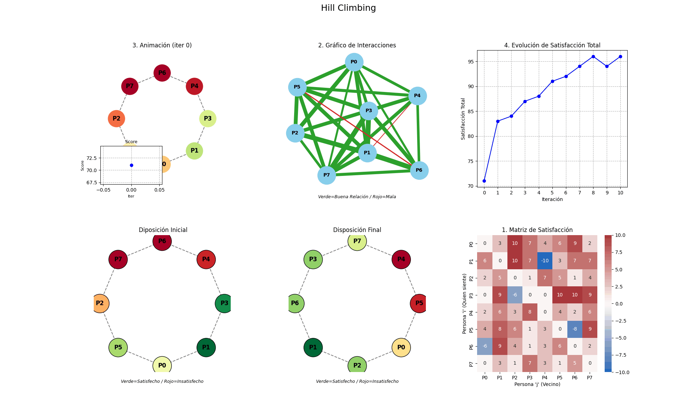

# 🧠 Sistema de Optimización de Asientos con Hill Climbing  
---

## 📛 Badges del Proyecto


---

# 🧩 Descripción 

Este proyecto implementa una **optimización de disposición de personas en sillas** basada en una **matriz de satisfacción**, utilizando el algoritmo **Hill Climbing**.

Además, produce un **dashboard** con animaciones en *Matplotlib*, mostrando:

- Disposición inicial  
- Disposición final  
- Evolución de la satisfacción  
- Interacciones entre personas  
- Matriz de satisfacción  
- Animación del proceso iterativo  

El sistema también **exporta automáticamente un GIF** con todas las iteraciones.


---

# 🚀 Funcionalidades del código

### ✔ Implementación completa de Hill Climbing Estocástico  
### ✔ Dashboard visual animado  
### ✔ GIF automático del proceso  
### ✔ Botón para reiniciar la simulación    
### ✔ Selección aleatoria de vecinos  
---

# 📦 Instalación sugerida antes de ejecución

```bash
pip install numpy matplotlib seaborn networkx pillow
```

---

# 🧠 Algoritmo Hill Climbing

El algoritmo busca maximizar la **satisfacción total**, definida como:

\[
Score = \sum_{i} (S[i][left(i)] + S[i][right(i)])
\]

donde:

- S es la matriz de satisfacción  
- La disposición es circular  

---

### 1️⃣ Generar disposición inicial

Una permutación aleatoria de personas.

Ejemplo:

```
[0, 3, 1, 4, 2, 5]
```

### 2️⃣ Evaluar score inicial

Se suman las satisfacciones izquierda/derecha.

### 3️⃣ Generar vecinos

Se crean permutaciones intercambiando dos personas:

```
swap(i, j)
```

Número de vecinos:  
\[
rac{n(n-1)}{2}
\]

### 4️⃣ Seleccionar vecino aleatoreamente

- Si el vecino **mejora**, se acepta inmediatamente.
- Si el vecino **empeora poco**, se acepta con probabilidad 0.25.
- Si empeora mucho, se rechaza.

### 5️⃣ Siguiente iteración
El proceso continúa hasta:

- superar un máximo de iteraciones
- no encontrar mejoras por varios pasos
- estabilización del score

---

# 🎨 Visualización (Paneles 1–6)

El dashboard final sigue esta disposición:

| Panel | Descripción |
|-------|-------------|
| **1** | Animación del proceso Hill Climbing |
| **2** | Gráfico estático de interacciones totales |
| **3** | Evolución del score (estático) |
| **4** | Disposición inicial |
| **5** | Disposición final |
| **6** | Matriz de satisfacción |



---

Al ejecutar:

- Se muestra el dashboard interactivo.  
- Los paneles se actualizan automáticamente.  
- Se genera un GIF.  
- Puedes reiniciar con el botón

<video controls src="Hill Climbing.mp4" title="Example"></video>

---

# 📜 Licencia

Este proyecto está bajo la **licencia MIT**.  
Uso libre para docencia, investigación y desarrollo.

---

# ✨ Autor

**Paula S**  
