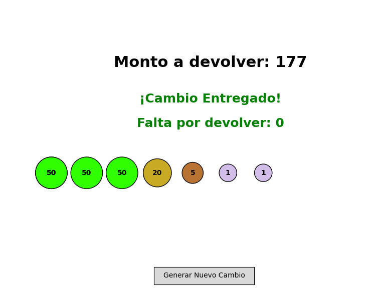

# 💰 Simulador de Cambio con Algoritmo Voraz

## Descripción

Este proyecto implementa un **algoritmo voraz** aplicado al problema  de dar cambio con monedas. El código calcula la forma óptima de devolver un monto utilizando la menor cantidad de monedas posibles y lo muestra mediante una animación.

## 🎯 Características

- **Algoritmo Voraz**: Implementación eficiente que selecciona siempre la moneda de mayor valor posible
- **Animación**: Representación gráfica paso a paso del proceso de entrega de cambio
- **Interfaz Interactiva**: Botón para generar nuevos casos aleatorios
- **Panel Informativo**: Seguimiento en tiempo real del monto restante y última moneda entregada
- **Diseño Atractivo**: Monedas con diferentes colores, tamaños y efectos de sombra

## 📋 Requisitos

```bash
pip install matplotlib
```
La aplicación se abrirá con una interfaz gráfica que muestra:
- Una animación del proceso de entrega de cambio
- Un panel lateral con información del proceso
- Un botón para generar nuevos casos aleatorios



## 🎨 Denominaciones de Monedas

El sistema utiliza las siguientes denominaciones:

| Valor | Color | Tamaño | Representación |
|-------|-------|--------|----------------|
| 50 | Dorado (#D4AF37) | Grande | Moneda de mayor valor |
| 20 | Plateado (#C0C0C0) | Mediano-Grande | Segunda denominación |
| 10 | Gris (#A8A8A8) | Mediano | Tercera denominación |
| 5 | Bronce (#CD7F32) | Mediano-Pequeño | Cuarta denominación |
| 1 | Púrpura (#9370DB) | Pequeño | Moneda de menor valor |

## 🧮 Algoritmo Voraz

### Funcionamiento

El algoritmo sigue estos pasos:

1. **Ordenar denominaciones**: Las monedas están ordenadas de mayor a menor (50, 20, 10, 5, 1)
2. **Selección voraz**: En cada paso, selecciona la moneda de mayor valor que no exceda el monto restante
3. **Iteración**: Repite el proceso hasta que el monto restante sea cero

### Ejemplo

Para un monto de **87**:
- 1 moneda de 50 → Restante: 37
- 1 moneda de 20 → Restante: 17
- 1 moneda de 10 → Restante: 7
- 1 moneda de 5 → Restante: 2
- 2 monedas de 1 → Restante: 0

**Total: 6 monedas**

vscode-remote://codespaces%2Bobscure-succotash-pjv9g75r5xwf7g57/workspaces/3er-Corte-Introduccion-IA/Laboratorio%205/Punto%202%20-%20Algoritmo%20adversariales%20/Adversarial.mp4

##  Posibles mejoras:
- Agregar diferentes sistemas monetarios

## 📄 Licencia

Este código es de uso educativo y puede ser modificado libremente.

---

**Desarrollado con** 🐍 Python y 📊 Matplotlib

## ✨ Autor

### Paula S