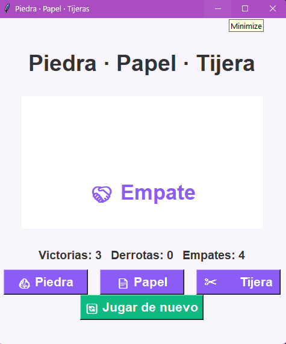

# 🎮🧠 Piedra · Papel · Tijeras  
## IA con Modelo de Markov + GUI Animada en Tkinter

Juego de **Piedra, Papel o Tijeras** con interfaz basada en **Tkinter** y una IA que aprende del jugador mediante un **Modelo de Markov**.  
Incluye estadísticas en pantalla y botón de reinicio que borra por completo el aprendizaje y los datos del jugador.

---

# ✨ Características 

### 🧠 IA basada en Modelo de Markov  
La IA analiza el historial del jugador y calcula la probabilidad de la siguiente jugada basándose entre elecciones consecutivas.

- El juego observa lo que eliges.
- Aprende patrones como “si eligió Piedra dos veces, suele jugar Tijera”.
- Predice tu posible siguiente movimiento.
- Escoge la jugada que le gane a la tuya.

---

# 📊 Estadísticas del jugador

- Victorias  
- Derrotas  
- Empates  
- Historial reciente  
- Patrones detectados por Markov  

Se reinician por completo al presionar **Jugar de nuevo**.

---
# 🔬 Conceptos Matemáticos
### Probabilidad de Transición

P(X_n = j | X_n-1 = i) = frecuencia(i → j) / Σ frecuencia(i → *)

Donde:

X_n: Estado en el tiempo n (jugada n)

i: Estado actual (últimas 2 jugadas)

j: Próximo estado (próxima jugada)

# 📈 Ventajas de Markov
VentajaDescripción⚡ 
EficienciaDecisiones en tiempo real sin cálculos complejos
- 🧠 Se adapta continuamente a tus patrones
- 📊 Fácil de entender e implementar
- 🎯 Funciona bien contra jugadores con patrones
- 💾 Solo guarda transiciones observadas

# ⚠️ Limitaciones

- Fase inicial: En las primeras 2 jugadas, la IA juega aleatoriamente porque no hay historial
- Jugadores aleatorios: Si juegas completamente al azar, la IA no puede aprender
- Orden de Markov: Solo considera las últimas 2 jugadas (memoria corta)
- Si cambias tu estrategia drásticamente, la IA tarda en adaptarse

## Ejemplo Numérico
Si después de (Piedra, Papel) has jugado:

- Tijera: 6 veces
- Piedra: 3 veces
- Papel: 1 vez

P(Tijera | (Piedra, Papel)) = 6/10 = 0.6 = 60%

P(Piedra | (Piedra, Papel)) = 3/10 = 0.3 = 30%

P(Papel | (Piedra, Papel)) = 1/10 = 0.1 = 10%

La IA predice Tijera (60% probabilidad) y juega Piedra para contrarrestarla.

# 🔧 Cambios más importantes implementados

- ✔ Botón “Jugar de nuevo” resetea estadísticas  

- ✔ Integración de Modelo de Markov de **segundo orden**  
La IA ahora analiza secuencias como:

    - (Piedra → Papel → ¿?)  
    - (Papel → Tijera → ¿?)  

- ✔ Código más organizado  
Clases y funciones separadas, mayor modularidad.

---
# 🎯 Conclusión

 a clave está en la implemantacion de este modelo de Markov, esta en :

✅ Observar patrones en el comportamiento del jugador
✅ Aprender continuamente de cada jugada
✅ Predecir probabilísticamente la próxima acción
✅ Contraatacar óptimamente basándose en la predicción

https://github.com/user-attachments/assets/7ff730b0-6046-486d-91a9-9ec3efc3183e

## ✨ Autor 
### Paula S

 
